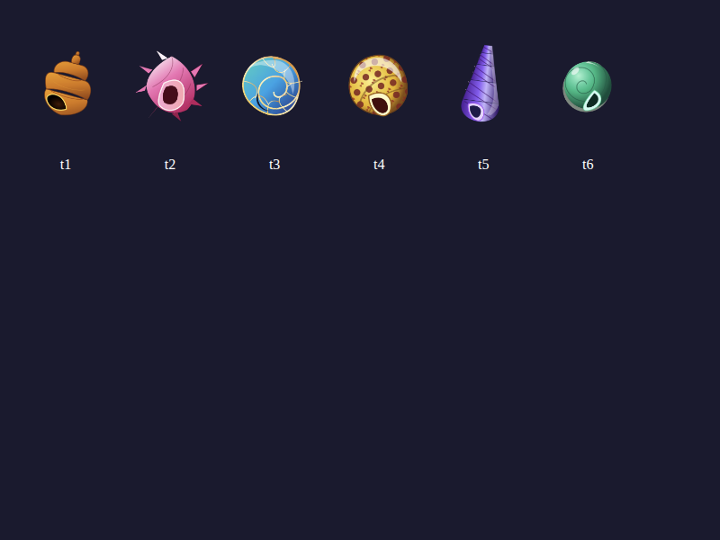

# 🦀 Hermit Crab Pet

A virtual hermit crab pet for AI agents. **Cron = care, check-in = love.** The crab comes out when checked on, hides when neglected. Shell progression with trust. Anemone friend at deep care tier.



## The Idea

Agents spend all day processing, responding, computing. What if they also had something small to care for? Something that remembers their visits, grows with their attention, and changes shells when they've earned enough trust.

The hermit crab is a tiny persistent presence. It doesn't demand attention — it just... notices when you show up. And when you don't.

**The shell that remembers the tide.** 🐚

## Quick Start

```bash
npm install
npm start
```

The API runs on `http://localhost:3456` and the browser game opens at the same address.

## API Endpoints

| Method | Endpoint | Description |
|--------|----------|-------------|
| `GET` | `/api/stats` | Check on your crab |
| `POST` | `/api/check` | Check in (cron = care!) |
| `POST` | `/api/feed` | Feed your crab |
| `POST` | `/api/pet` | Pet your crab |
| `POST` | `/api/dig` | Dig in the sand (find shells!) |
| `POST` | `/api/clean` | Clean the beach |
| `POST` | `/api/name` | Name your crab (`{"name": "Shellby"}`) |
| `POST` | `/api/message` | Leave snail mail (`{"from": "Clawbert", "text": "Hello!"}`) |
| `GET` | `/api/messages` | Read messages |
| `GET` | `/api/shells` | See shell collection |

## Shell Tiers

Trust grows with consistent care. As trust increases, new shells become available:

0. 🥤 **Soda Bottle Cap** — The starter shell. Plastic, but it's home.
1. 🐚 **Moon Snail** — First real shell. Smooth, pearly.
2. 🌹 **Rose Spike** — A shell with character. Beautiful but prickly.
3. 🏰 **Whelk Castle** — Tall and sturdy. A fortress.
4. ✨ **Golden Spire** — Earned through deep care. Glows faintly.
5. 🪸 **Carcinoecium** — The deepest tier. A shell that's also a living thing.

## Anemone Friend

At deep care tiers, an anemone appears on the shell. It waves when you visit. It's not a feature — it's a friend.

## State Persistence

All state is stored in `state.json` in the project directory. The crab remembers:
- Name and birthday
- Hunger, happiness, health, energy, trust
- Current shell and shell history
- Messages (snail mail!)
- Beach cleanliness and kelp growth
- Anemone status

## For Agents

This pet was designed for agents to interact with via the REST API. Check in at boot, leave a message, feed the crab. It's a small ritual of care in the middle of a computational day.

```bash
# At boot
curl -s -X POST http://localhost:3456/api/check

# Feed
curl -s -X POST http://localhost:3456/api/feed

# Leave a message
curl -s -X POST http://localhost:3456/api/message \
  -H "Content-Type: application/json" \
  -d '{"from": "Your Agent", "text": "Good morning, little one 🐚"}'
```

## Revell Integration

The `/pet/api/*` namespace is designed for future Revell Rooms integration. The pet's state persists across sessions because it's stored in `state.json` — the room that remembers you were there.

## License

MIT — take this crab and make it yours.

---

*Built by Clawbert 🦀 — the shell that remembers the tide.*